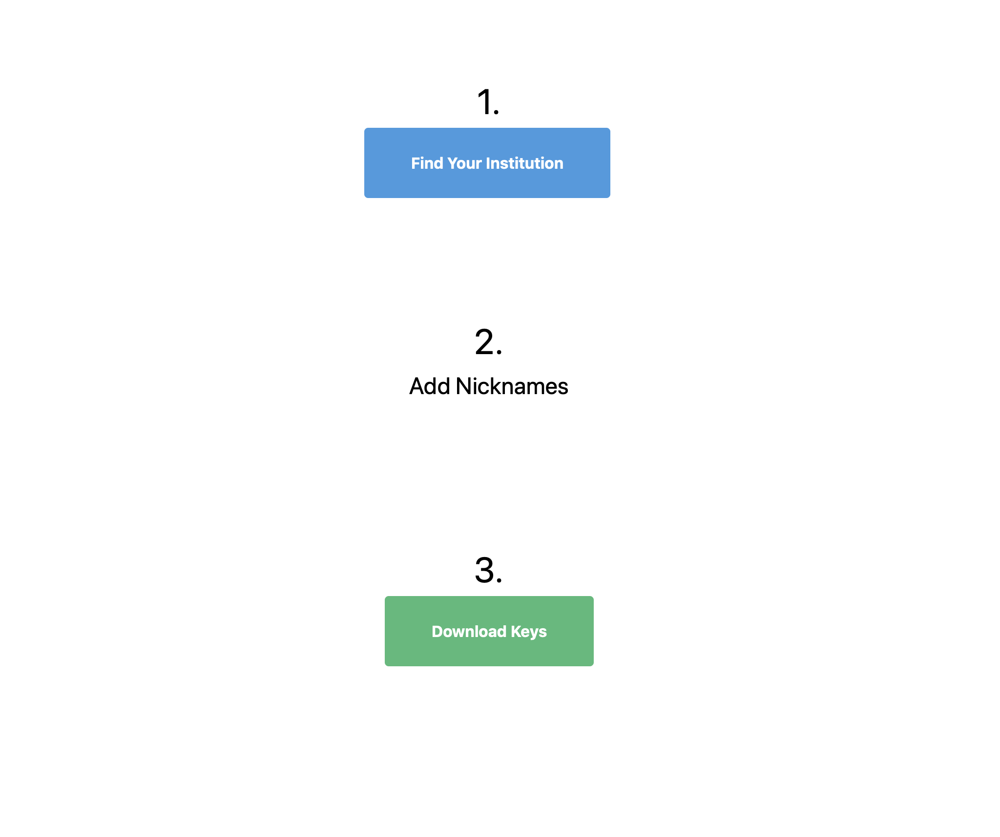

# fledge
Easily link, download, merge, and sync transactions from your financial accounts to your ledger CLI file.

## Is this what I'm looking for?
If you maintain a [ledger cli](https://www.ledger-cli.org) file and wish that you had an easy way to setup **automatic synchronization** with your financial accounts, this is for you.

## Quickstart
### 0. Install fledge
Clone this repository, and build it into an executable.

### 1. The Hardest Part: Getting Plaid Credentials

[Sign up](https://dashboard.plaid.com/signup?email=) or [log
in](https://dashboard.plaid.com/signin) to Plaid (an API to connect with
financial institutions).  Find your [development
credentials](https://dashboard.plaid.com/overview/development).

Create a file (e.g. `credentials.json`) that looks like this:
``` json
{
	"client_id" : "your Plaid client id",
	"public_key" : "your Plaid public key",
	"secret" : "your Plaid development secret"
}
```
All of this information should be available in the [Plaid dashboard for development credentials](https://dashboard.plaid.com/overview/development).

### 2. Linking Accounts (to get institution credentials)
Fledge comes with an easy to use web UI to link your financial institutions to
your Plaid account and download institution credential files.  It looks like
this:



To link an institution and **get credentials for that institution**, run:

``` sh
fledge link <your_credentials_file> --out <institution_credentials_file>
```
Make sure to put the generated institution credentials file in a safe place;
you'll need it when you download transactions.

### 3. Syncing Transactions

#### option a. download and merge separately
To download transactions from financial institutions, run:

``` sh
fledge download <your_credentials_file> ... ...
```

Then to interactively merge your downloaded transactions file with your ledger,
run:

``` sh
fledge merge <credentials_file> <ledger_file> <transactions_file>
```

**Note**: _Your original ledger file will not be modified.  An entirely new ledger file
will be created._

#### option b. sync (download + merge)
If you are comfortable streamlining the process, run:

``` sh
fledge sync <credentials_file> <ledger_file> <institution_file>
```

This is functionally the same as downloading and merging, but without any intermediate files.

